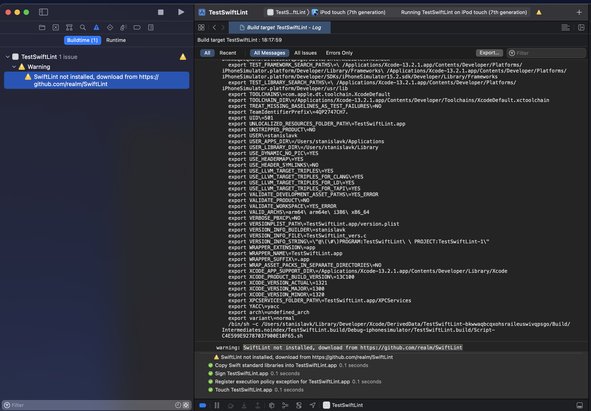

# SwiftLint in Xcode on Apple silicon/M1

>I have installed *SwiftLint* with *Brew* (and it is up and working fine), nevertheless when using original script as suggested in [realm/SwiftLint](https://github.com/realm/SwiftLint#xcode) - it does not work. The following warning is presented by Xcode and there is no "linting" 😱.



# Explanation and temporary solution

As of Feb 2021, *Homebrew* version 3.0.0 started officially support Apple silicon/M1. The catch is, Brew (on Apple silicon/M1) is now installed in `/opt/homebrew` i.e. when installing `SwiftLint` with Brew, it is installed in the `/opt/homebrew/bin` folder and not in `/usr/local/bin` as in case of Intel based chips.

It turns out, that *Xcode* when executing script with `/bin/sh` shell do not see the PATH for such installed `SwiftLint` (this is a Xcode issue and not a Brew installation issue) and executes the warning.

Unfortunately, it seems, it is now not possible to modify the PATH for Xcode (13.2.1) permanently, but you can change the script to test if `SwiftLint` has been installed by `Brew` on Apple silicon/M1 and export the PATH for the duration of the Xcode run.

i.e.

```
# Support for SwiftLint installed by Brew on M1/Apple silicon
if test -d "/opt/homebrew/bin/"; then
  PATH="/opt/homebrew/bin/:${PATH}"
  export PATH
fi

if which swiftlint >/dev/null; then
  swiftlint
else
  echo "warning: SwiftLint not installed, download from https://github.com/realm/SwiftLint"
fi

```
